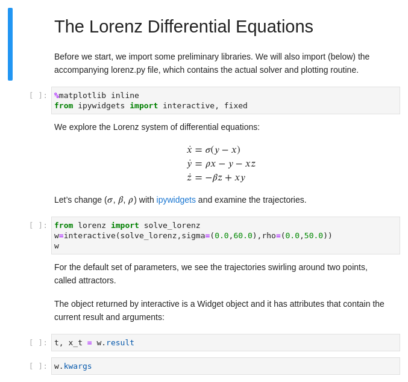

# Asciidoctor Jupyter Converter

A Jupyter converter for Asciidoctor.js. Write your Notebook in AsciiDoc!


[](https://www.npmjs.com/package/asciidoctor-jupyter)

## Install

    $ npm i asciidoctor-jupyter

## Usage

In order to use this converter, you will need to install [Asciidoctor.js](https://docs.asciidoctor.org/asciidoctor.js/latest/setup/install/).
Verify that the `asciidoctor` command is now available on your `PATH` by running:

    $ asciidoctor -v

### From the CLI (Command Line Interface)

To convert an AsciiDoc file to a Jupyter Notebook, open a terminal and type:

    $ asciidoctor -r asciidoctor-jupyter -b jupyter notebook.adoc

The above command will generate a file named `notebook.ipynb`.

### From the API

```js
const asciidoctor = require('@asciidoctor/core')()
const JupyterConverter = require('asciidoctor-jupyter')

// register the converter
asciidoctor.ConverterFactory.register(JupyterConverter, ['jupyter'])

// convert an AsciiDoc file
asciidoctor.convertFile('notebook.adoc', { backend: 'jupyter' })
```

## Write your Notebook

Here's a basic example of notebook written in AsciiDoc:

```adoc
= The Lorenz Differential Equations
:jupyter-language-name: python
:jupyter-language-version: 3.7.8
:url-ipywidgets: https://ipywidgets.readthedocs.io/en/stable/

Before we start, we import some preliminary libraries.
We will also import (below) the accompanying `lorenz.py` file,
which contains the actual solver and plotting routine.

[source,python]
----
%matplotlib inline
from ipywidgets import interactive, fixed
----

We explore the Lorenz system of differential equations:

[latexmath]
++++
\begin{aligned}
\dot{x} & = \sigma(y-x) \\
\dot{y} & = \rho x - y - xz \\
\dot{z} & = -\beta z + xy
\end{aligned}
++++

Let's change (stem:[\sigma], stem:[\beta], stem:[\rho]) with {url-ipywidgets}[ipywidgets] and examine the trajectories.

[source,python]
----
from lorenz import solve_lorenz
w=interactive(solve_lorenz,sigma=(0.0,60.0),rho=(0.0,50.0))
w
----

For the default set of parameters, we see the trajectories swirling around two points, called attractors.

The object returned by `interactive` is a `Widget` object and it has attributes that contain the current result and arguments:

[source,python]
----
t, x_t = w.result
----

[source,python]
----
w.kwargs
----
```

And here's the result:



## Document attributes

| Name                       | Default Value | Mapping                          |
|----------------------------|---------------|----------------------------------|
| `jupyter-language-name`    | `python`      | `metadata.language_info.name`    |
| `jupyter-language-version` | `3.9.1`       | `metadata.language_info.version` |
| `jupyter-kernel-name`      | `python3`     | `metadata.kernelspec.name`       |
| `jupyter-kernel-language`  | `python`      | `metadata.kernelspec.language`   |

**IMPORTANT:** The language name defined in `jupyter-language-name` will be used to decide which AsciiDoc source blocks will be converted to Notebook code cells and which will be converted to Markdown cells.
For instance, if the Jupyter language name is `python` the converter will convert source blocks that have the language `python` to code cells. Source blocks with other languages will be converted as Markdown cells.

## Notebook file format

This converter generates [Jupyter notebooks] using [Notebook file format](https://nbformat.readthedocs.io/en/latest/format_description.html) version 4.4.
